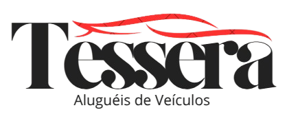

  
 
    

## Principais tecnologias e bibliotecas utilizadas:

- Node.js + TypeScript
- Express e Express Async Errors
- TypeORM + PostgreSQL
- Redis + Rate Limiter
- JWT para autenticação
- Multer para upload de arquivos
- Nodemailer para envio de emails
- Sentry para monitoramento e rastreamento de erros
- Swagger para documentação da API
- Bcrypt para hashing de senhas
- AWS SDK para integração com serviços AWS
- Dayjs para manipulação de datas
- CSV Parse, Handlebars, UUID, entre outros
- Jest e Supertest para testes automatizados

## Sobre o Projeto

Tessera é uma plataforma de aluguel de veículos de todos os tipos, pensada para oferecer flexibilidade, segurança e praticidade tanto para locadores quanto para clientes. Com o Tessera, é possível:

- Cadastrar e listar veículos de diversos tipos (carros, motos, caminhões, utilitários e muito mais)
- Realizar reservas de forma rápida e segura
- Gerenciar seus veículos e acompanhar o histórico de aluguéis
- Receber notificações e atualizações em tempo real
- Acompanhar o status da locação, desde a solicitação até a devolução
- Integrações futuras com serviços de pagamento e validação de documentos
- A plataforma é ideal para pessoas físicas e empresas que desejam oferecer ou alugar veículos com eficiência e controle total.

## Licença

Este projeto está sob a licença MIT. Para mais detalhes, leia o arquivo LICENSE.
